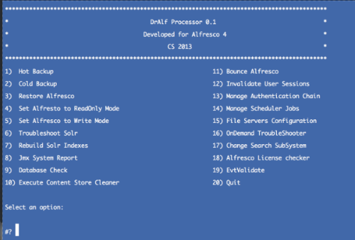

--------------
Dr Alf - 0.1
------------- 
    
    Project location : https://github.com/lcabaceira/dralf

-----------------
Target Audience :
-----------------

    Alfresco Administrators 
    Alfresco developers and Alfresco Students
    A Tool for Alfresco Support Team
    
-------------
Introduction :
------------- 

Dr. Alf is mostly a Jmx encapsulator that communicates with Alfresco via JMX. It targets and automate specific
JMX actions giving the user a most rewarding experience on administration and troubleshooting tasks within Alfresco.

It automates Alfresco backup and restore processes, allowing operations such as hot backups, cold backups , restores and other handy operations. 
It uses jmxterm as a command line jmx client , you can find documentation on jmxterm at http://wiki.cyclopsgroup.org/jmxterm/features

It is also a very nice tool for troubleshooting and system analysis as it embeds the well known Alfresco Valitation tool ( EVT )

Overall we can define Dr. Alf as :

    * JMX Encapsulator
    * Alfresco Backup Manager Tool
    * Alfresco Troubleshooting Tool

--------------------
Suported Databases :
--------------------

The current early bird version of Dr. Alf supports the following databases :

    * MySql Database
    * PostGres Sql Database

Note : This restriction is related to the procedures on how to perform Hot Backups. Oracle and SQL Server have their own
Hot backup tools, and those currently are not integrated with the tool.

--------------------
Suported OS        :
--------------------

The current early bird version supports the following Operating Systems :

    * Mac OSx
    * Mostly all Linux distributions ( Ubunto, Red Hat, etc ) 

Note : Dr. Alf can run on windows, but if requires cygwin installed and configured.    

--------------------
Pre-Requirements   :
--------------------

Dr. Alf has the following pre-requirements :

    * Maven 2
    * Jdk 1.6+
    
----------------------
1 - Installing Dr Alf. 
----------------------

Dr. Alf is currently released as a multi-module maven project. 

Dr. Alf should be installed on the same machine where the Alfresco Content server resides. 
If you have a clustered Alfresco, you need to install Dr Alf on one of the cluster nodes. 
Changes will propagate to all the nodes. Working with Dr. Alf in a clustered environment is detailed on 
the Dr. Alf Cluster How to document, that will be released soon.

The current version only uses the command line
module, named dralfssh. To build the project you just have to run the following maven command.

- `mvn clean install` 

This will build 2 modules, and you will be using dralfssh.

After the build is complete, go to the target/dralfssh directory you are ready to proceed to the next step.

-----------------------------------------
2 - Configure for the target environment
-----------------------------------------

Dr. Alf works directly with your alfresco, and has the ability to read the properties configured either in 
the alfresco-global.properties on in the repository.properties file of Alfresco. There are a few
initial properties that have to be set to have a fully functional version of Dr. Alf.

Change to dralfssh/target/dralfssh-0.1-bin and open dralf.properties for editing.
Adapt the properties to reflect you local alfresco environment.

-----------------------
3 - Accessing the tool
-----------------------

    * Go to the installation directory of Dr Alf.
    * Change to dralfssh/target/dralfssh-0.1-bin
    * run ./dralf.sh menu

------------------------------------    
Strong Features
------------------------------------
   
   * OnDemand troubleshooting of several Alfresco components
   * Ability to automate complex sub-system changes
   * Automates Backup and restore procedures, eliminating the probability of human errors.
   * Performs automatic Hot Backups to the hole Alfresco implementation
   * Strong focus on troubleshooting Solr and Lucene Indexing / Searching and Tracking
   * Able to comunicate and operate on both Alfresco and SOLR jmx servers
   * Not intrusive of abusive to any environment, easy installation and maintenance.
   * Jmx changes also update the values in alfresco-global.properties
   * Jmx changes are cluster wide
   * Ability to perform sub-system changes without stopping alfresco.

------------------------------------    
Weak Points 
------------------------------------
   
   * NO GUI ( command line tool ) 
   * Decoupled from Share admin interface.
   * Does not support Oracle of Sql Servers Databases
   * Reports contain relevant information and should be xml or html instead of plain text
 
 
------------------------------------    
Decoupled Actions Architecture
------------------------------------
  
  DrAlf is basically a group of scripts that execute certain actions such as performing a Hot Backup or troubleshoot
  the Search subsystem. Each one of this actions is coded in a separated .sh script, allowing it to be executed as 
  a separate unit. This highly decoupled architecture allows the enduser to easily extend DrAlf by developing their
  own jmx driven scrips and action sequences.
  
----------------------------------------------------------    
DrAlf Technical documentation ( Actions explained 1 by 1 ) 
----------------------------------------------------------

  If you want to check the details of the implementation on each one of the actions, you should click on the following link.
  
[Technical Documentation on the DrAlf actions - Individual Action Explanation ](TECHDETAILS.md)

------------------------------------    
Future view
------------------------------------
The idea is to integrate Dr. Alf within Share as a plugin, extending the existing administration tasks.
It will be distributed as software package + an AMP file for the share UI adaptations.

Also, when using Solr, Dralf has the ability to connect to the Solr Mbeans, and this feature can be explored to
fine tune Solr in read time using Jmx.

------------------------------------    
About Jmxterm
------------------------------------
Jmxterm is an open source command line based interactive JMX client. It allows you to easily navigate JMX MBeans on remote servers without running 
a graphical interface or opening a JMX port. It can also be integrated with script languages such as Bash, Perl, Python, Ruby, etc. 

------------------------------------    
DrAlf Sample Screenshot
------------------------------------

 

