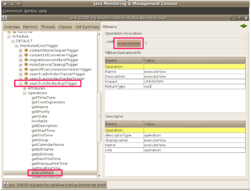

------------------------------
Dr Alf Technical Details - 0.1
------------------------------

This document contains the technical details on each one of the actions exposed by DrAlf.

    Project location : https://github.com/lcabaceira/dralf

-----------------
Target Audience :
-----------------

    Alfresco Administrators 
    Alfresco developers and Alfresco Students
    A Tool for Alfresco Support Team 

----------------------------
Maven Multi Module Project :
----------------------------

DrAlf is released as a multi-module maven project but currently only dralfssh module is being used.
The other dralfjar module is reserved for future usage as the project grows.

--------------------------------
0 - SEARCH ENGINE BACKUP TRIGGER
-------------------------------- 

    * Script Name : searchEngineBackupTrigger.sh   
    * Location    : <drAlfInstallDir>/utils
    * Bean Id     : Alfresco:Name=Schedule,Group=DEFAULT,Type=MonitoredCronTrigger,Trigger=search.indexBackupTrigger
    * Jmx Server  : Alfresco application Server   
    * Jmx Domain  : Alfresco   

Description : This script executes the Alfresco indexBackupTrigger schedule Job.

    - Trigger the Search Sub System Indexes Backup Scheduled Job

It executes the same action that you can see on the following jconsole screenshot.

 

----------------
1 - HOT BACKUP :
---------------- 

    * Script Name : hotBackup.sh   
    * Location    : <drAlfInstallDir>/utils
    * Bean Id     : N/A
    * Jmx Server  : N/A   
    * Jmx Domain  : N/A  

Description : This script automates a full Alfresco Backup according to the recommended best practices. Backups are stored in the
backups directory of DrAlf.

    - Run the Content Store Cleanup Scheduled Job
    - Trigger the Search Sub System Indexes Backup Scheduled Job
    - Execute the database Hot Backup procedure
    - Backup the repository filesystem
    - Backup Search Sub System Indexes
    - Build the backup bundel (.abk file)

The backups are created as a single .abk file ( Alfresco Backup File ). The backup files follow a
naming convention that uses the current timestamp to differentiate backup file.

    - "Backup-YYYYmmddhhmm.abk". 
    -  YYYY - current year, mm current month, dd current day, hh current hour, mm current minute.
    
The backup file it's built using the Linux command 'tar'. This command allow us to generate a package, that once 
uncompressed will place the files on the correct locations with little effort.

"Guidelines" 

According to Alfresco best practices hot backups should be performed in the following order:

1.  Backup the Lucene indexes.
2.  Backup the database Alfresco is configured to use, using your database vendor's backup.
3.  As soon as the database backup completes, backup specific subdirectories in the Alfresco dir.root
4.  Finally, store both the database and Alfresco dir.root backups together as a single unit. For example, 
    store the backups in the same directory or in a single compressed file.
    
Lucene then SQL: Lucene indexes have to be backed up first and before SQL because if new rows are added in 
SQL aTer the lucene backup is done, a lucene reindex (AUTO) can regenerate the missing Lucene indexes from 
the SQL transacCon data.

SQL then Files: SQL have to be done before files because if you have a SQL node pointing to a missing file that 
node will be orphan. On the contrary, if you have a file without SQL node data, this just means that the user 
has added the file too late to be included in a backup.
    
-----------------
2 - COLD BACKUP :
----------------- 

    * Script Name : coldBackup.sh   
    * Location    : <drAlfInstallDir>/utils
    * Bean Id     : N/A
    * Jmx Server  : N/A   
    * Jmx Domain  : N/A   
    
Description: This script automates a full Alfresco Backup according to the recommended best practices. Its exaclty the same procedure 
as the Hot backup with the only difference that it stops alfresco during the backup execution.Backups are stored in the backups directory 
of DrAlf.
    
----------------------
3 - RESTORE ALFRESCO :
---------------------- 

    * Script Name : restoreAlfresco.sh   
    * Location    : <drAlfInstallDir>/utils
    * Bean Id     : N/A
    * Jmx Server  : N/A   
    * Jmx Domain  : N/A  

Description:  Restoring its all about reverting the Backup Process, so the restore action compromises the following;

    - Extract bundled files using the tar command
    - Shutdown Alfresco
    - Restore database backup using the appropriate database tool
    - Restore filesystem backup using the tar command
    - Start Alfresco
    - Monitor the alfresco.log file for any errors/ warnings.
    
-----------------------------------
4 - SET ALFRESCO TO READONLY MODE :
----------------------------------- 

    * Script Name : readonly.sh   
    * Location    : <drAlfInstallDir>/utils
    * Bean Id     : Alfresco:Type=Configuration,Category=sysAdmin,id1=default
    * Jmx Server  : Alfresco application Server   
    * Jmx Domain  : Alfresco    

Description: Sets alfresco to ReadOnly mode. 

* Action Jmx Code * 
 
domain Alfresco 
bean Alfresco:Type=Configuration,Category=sysAdmin,id1=default 
set server.allowWrite false 
quit

-----------------------------------
5 - SET ALFRESCO TO WRITE MODE :
----------------------------------- 

    * Script Name : writeMode.sh   
    * Location    : <drAlfInstallDir>/utils
    * Bean Id     : Alfresco:Type=Configuration,Category=sysAdmin,id1=default
    * Jmx Server  : Alfresco application Server   
    * Jmx Domain  : Alfresco  

Description: Sets alfresco to Write mode. 

* Action Jmx Code *
  
domain Alfresco 
bean Alfresco:Type=Configuration,Category=sysAdmin,id1=default 
set server.allowWrite true 
quit

-----------------------------------
6 - TROUBLESHOOT LUCENE INDEXING 
----------------------------------- 

    * Script Name : troubleshootIndexing.sh
    * Location    : <drAlfInstallDir>/utils
    * Bean Id     : log4j:logger=org.alfresco.repo.search.impl.lucene.fts.FullTextSearchIndexerImpl
    * Bean Id     : log4j:logger=org.alfresco.repo.search.Indexer
    * Bean Id     : log4j:logger=org.alfresco.repo.search.impl.lucene.index
    * Jmx Server  : Alfresco application Server   
    * Jmx Domain  : Alfresco 

Description: Sets the FullTextSearch Indexer Log levels to Debug allowing for quick troubleshoot by tailing
tailing the alfresco log file and getting detailed logs for a controlled period of time.

* Action Jmx Code *
    
domain log4j 
bean log4j:logger=org.alfresco.repo.search.Indexer 
set priority DEBUG 
bean log4j:logger=org.alfresco.repo.search.impl.lucene.fts.FullTextSearchIndexerImpl 
set priority DEBUG 
bean log4j:logger=org.alfresco.repo.search.impl.lucene.index 
set priority DEBUG 
quit

-------------------------------------
7 - STOP TROUBLESHOOT LUCENE INDEXING 
------------------------------------- 

    * Script Name : troubleshootIndexing.sh
    * Location    : <drAlfInstallDir>/utils
    * Bean Id     : log4j:logger=org.alfresco.repo.search.impl.lucene.fts.FullTextSearchIndexerImpl
    * Bean Id     : log4j:logger=org.alfresco.repo.search.Indexer
    * Bean Id     : log4j:logger=org.alfresco.repo.search.impl.lucene.index
    * Jmx Server  : Alfresco application Server   
    * Jmx Domain  : Alfresco 

Description: Stops the troubleshoot on Lucene Indexing by setting the FullTextSearch Indexer Log levels back to their original values. 

* Action Jmx Code *
    
domain log4j 
bean log4j:logger=org.alfresco.repo.search.Indexer 
set priority ERROR 
bean log4j:logger=org.alfresco.repo.search.impl.lucene.fts.FullTextSearchIndexerImpl 
set priority ERROR 
bean log4j:logger=org.alfresco.repo.search.impl.lucene.index 
set priority ERROR 
quit 

-------------------------------------
8 - JMX SYSTEM REPORT
------------------------------------- 

    * Script Name : jmxSystemReport.sh
    * Location    : <drAlfInstallDir>/utils
    * Bean Id     : bean Alfresco:Name=RepositoryDescriptor,Type=Server
    * Bean Id     : Alfresco:Name=Runtime
    * Bean Id     : Alfresco:Name=Authority
    * Bean Id     : Alfresco:Name=ConnectionPool
    * Bean Id     : Alfresco:Name=ContentTransformer,Type=ImageMagick
    * Bean Id     : Alfresco:Name=ContentTransformer,Type=pdf2swf
    * Bean Id     : Alfresco:Name=LuceneIndexes,Index=workspace/SpacesStore 
    * Bean Id     : Alfresco:Name=LuceneIndexes,Index=archive/SpacesStore 
    * Bean Id     : Alfresco:Name=LuceneIndexes,Index=user/alfrescoUserStore 
    * Jmx Server  : Alfresco application Server   
    * Jmx Domain  : Alfresco 

Description: Generates System Report from the Monitoring Beans targeting specific pre-defined Beans. Reports are stored in the reports directory
of DrAlf. This report includes the following :

    - Alfresco Edition ( Community | Enterprise )
    - Alfresco Total Memory
    - Alfresco Max Memory
    - Alfresco Free Memory
    - Number of syncronized Groups
    - Number of syncronized Users
    - Active Connections on the Alfresco Connection Pool
    - Idle Connections on the Alfresco Connection Pool
    - Initial Size of the the Alfresco Connection Pool
    - Other relevant Connection Pool metrics
    - Information on the Content Transformers being used
    - Information on the Indexes ( # Indexed Documents, etc ) 

* Action Jmx Code *
    
domain Alfresco  
bean Alfresco:Name=RepositoryDescriptor,Type=Server 
bean 
get Version 
get Edition 
bean Alfresco:Name=Runtime 
bean 
get TotalMemory 
get MaxMemory 
get FreeMemory 
...
... more details just open the jmxSystemReport.sh
...
quit 

-------------------------------------
9 - DATABASE CHECK 
------------------------------------- 

    * Script Name : schemaValidator.sh
    * Location    : <drAlfInstallDir>/utils
    * Bean Id     : Alfresco:Name=DatabaseInformation,Tool=SchemaValidator 
    * Bean Id     : Alfresco:Name=DatabaseInformation,Tool=SchemaExport
    * Jmx Server  : Alfresco application Server   
    * Jmx Domain  : Alfresco 

Description: Validates Database and dumps validated schema as XML. This action generates a report a in the reports directory of DrAlf.

* Action Jmx Code *
    
domain Alfresco 
bean Alfresco:Name=DatabaseInformation,Tool=SchemaValidator  
run validateSchema 
bean Alfresco:Name=DatabaseInformation,Tool=SchemaExport 
run dumpSchemaToXML 
quit 

-------------------------------------
10 - EXECUTE CONTENT STORE CLEANER
------------------------------------- 

    * Script Name : contentCleanUpJobTrigger.sh
    * Location    : <drAlfInstallDir>/utils
    * Bean Id     : Alfresco:Name=Schedule,Group=DEFAULT,Type=MonitoredCronTrigger,Trigger=contentStoreCleanerTrigger
    * Jmx Server  : Alfresco application Server   
    * Jmx Domain  : Alfresco 

Description: Triggers the execution of the Content Store Cleaner Scheduled Job

"Guidelines" 

Cleaning up Orphaned Content (Purge)
Once all references to a content binary have been removed from the metadata, the content is said to be orphaned. Orphaned content can 
be deleted or purged from the content store while the system is running. Identifying and either sequestering or deleting the orphaned 
content is the job of the contentStoreCleaner.

In the default configuration, the contentStoreCleanerTrigger fires the contentStoreCleaner bean. This bean 

  <bean id="contentStoreCleaner" class="org.alfresco.repo.content.cleanup.ContentStoreCleaner" >
     ...
     <property name="protectDays" >
        <value>14</value>
     </property>
     <property name="stores" >
        <list>
           <ref bean="fileContentStore" />
        </list>
     </property>
     <property name="listeners" >
        <list>
           <ref bean="deletedContentBackupListener" />
        </list>
     </property>
  </bean>

This DrAlf action can be extended to cope with the user business needs by setting the following properties  :

- protectDays
        
Use this property to dictate the minimum time that content binaries should be kept in the contentStore. In the above example,if a file is created
and immediately deleted, it will not be cleaned from the contentStore for at least 14 days. The value should be adjusted to account for backup 
strategies, average content size and available disk space. Setting this value to zero will result in a system warning as it breaks the transaction
model and it is possible to lose content if the orphaned content cleaner runs whilst content is being loaded into the system. If the system backup
strategy is just to make regular copies, then this value should also be greater than the number of days between successive backup runs.

- store

This is a list of ContentStore beans to scour for orphaned content.

- listeners

When orphaned content is located, these listeners are notified. In this example, the deletedContentBackupListener copies the orphaned content to a separate
deletedContentStore.Note that this configuration will not actually remove the files from the file system but rather moves them to the designated deletedContentStore,
usually contentstore.deleted. The files can be removed from the deletedContentStore via script or cron job once an appropriate backup has been performed.

* Action Jmx Code *
    
domain Alfresco 
bean Alfresco:Name=Schedule,Group=DEFAULT,Type=MonitoredCronTrigger,Trigger=contentStoreCleanerTrigger 
run executeNow 
quit 

-------------------------------------
11 - BOUNCE ALFRESCO
------------------------------------- 

    * Script Name : bounceAlfresco.sh
    * Location    : <drAlfInstallDir>/utils
    * Bean Id     : N/A
    * Jmx Server  : N/A   
    * Jmx Domain  : N/A

Description: Restarts your alfresco application server

* Action Jmx Code *
    
N/A

-----------------------------
12 - INVALIDATE USER SESSIONS
-----------------------------

    * Script Name : bounceAlfresco.sh
    * Location    : <drAlfInstallDir>/utils
    * Bean Id     : Alfresco:Name=RepoServerMgmt
    * Jmx Server  : Alfresco application Server   
    * Jmx Domain  : Alfresco 

Description: Invalidates all current user sessions.

* Action Jmx Code *

domain Alfresco 
bean Alfresco:Name=RepoServerMgmt 
run invalidateTicketsAll 
quit 

--------------------------------
13 - MANAGE AUTHENTICATION CHAIN
--------------------------------

    * Script Name : authenticationChainManager.sh
    * Location    : <drAlfInstallDir>/utils
    * Bean Id     : 
    * Jmx Server  : Alfresco application Server   
    * Jmx Domain  : Alfresco 

Description: Allows the user to manage the authentication chain used by alfresco

* Action Jmx Code *

-----------------------------
14 - MANAGE SCHEDULER JOBS
-----------------------------

    * Script Name : scheduleJobsManager.sh
    * Location    : <drAlfInstallDir>/utils
    * Bean Id     : Alfresco:Name=Schedule,Group=DEFAULT,Type=MonitoredCronTrigger,Trigger=contentStoreCleanerTrigger
    * Bean Id     : Alfresco:Name=Schedule,Group=DEFAULT,Type=MonitoredCronTrigger,Trigger=nodeServiceCleanupTrigger
    * Bean Id     : Alfresco:Name=Schedule,Group=DEFAULT,Type=MonitoredCronTrigger,Trigger=search.alfrescoCoreBackupTrigger
    * Bean Id     : Alfresco:Name=Schedule,Group=DEFAULT,Type=MonitoredCronTrigger,Trigger=tempFileCleanerTrigger
    * Bean Id     : Alfresco:Type=Configuration,Category=Synchronization,id1=default
    * Jmx Server  : Alfresco application Server   
    * Jmx Domain  : Alfresco 

Description: Allows Immediate control over the execution of the Alfresco common schedule Jobs. It allows the user to execute 
the content store cleaner, the node service cleaner, the index backup trigger, the temporary files cleaner and to perform the
ldap user/group synchronization.

- <b>About the Node Service Cleaner</b>
    
The Node service cleaner is a scheduled job that runs to tidy up the database. This clean-up job executes every day at 21:00 (bean 'nodeServiceCleanupTrigger')
leading to bean 'nodeServiceCleanupJobDetail'), and performs the work found inside 'DeletedNodeCleanupWorker'.
After 30 days from when the 'node_deleted' field was set to '1', this process considers it safe to truly delete the node with a call to the DAO service purge.
Note: it doesn't use the audit_modifed date, since this wasn't changed when the row was marked for deletion. Instead, it uses the commit_time_ms transaction time 
from the alf_transaction table. This job also removes old transactions from the alf_transaction table. Transactions are considerd old using the same property as node
removal work: '30 days'; Defined using the property 'index.tracking.minRecordPurgeAgeDays').

Performs cleanup operations on DM node data, including old deleted nodes and old transactions. In a clustered environment, this job could be enabled on a headless 
(non-public) node only, which will improve efficiently.

Note : You can debug the Node service cleaner job by enabling log4j.logger.org.alfresco.repo.node.cleanup.NodeCleanupJob=DEBUG

- <b>About the Content Store Cleaner</b>

Launches the contentStoreCleaner bean, which identifies, and deletes or purges orphaned content from the content store while the system is running. Content is said 
to be orphaned when all references to a content binary have been removed from the metadata. By default, this job is triggered at 4:00 am each day. In a clustered 
environment, this job could be enabled on a headless (non-public) node only, which will improve efficiently.

- <b>About the Temporary Files Cleaner</b>

Cleans up all Alfresco temporary files that are older than the given number of hours. Subdirectories are also emptied and all directories below the primary temporary 
subdirectory are removed. The job data must include the protectHours property, which is the number of hours to protect a temporary file from deletion since its last 
modification.

- <b>About the Index Backup Trigger</b>

Creates a safe backup of the Lucene/Solr directories.

- <b>About the Ldap User Synchronization</b>

Triggers a Users/Groups Ldap synchronization

This action compromises several sub-actions depending on the user selections. To see the jmx code used, open the scheduleJobsManager.sh file.

--------------------------------
15 - FILE SERVERS CONFIGURATION
--------------------------------

    * Script Name : fileServerSubsystemChanger.sh
    * Location    : <drAlfInstallDir>/utils
    * Bean Id     : Alfresco:Name=FileServerConfig
    * Jmx Server  : Alfresco application Server   
    * Jmx Domain  : Alfresco 

Description: Allows the user to Enable or disable de several supported file servers. CIFS, NFS and FTP

* Action Jmx Code - SAMPLE FOR CIFS *

domain Alfresco 
bean Alfresco:Name=FileServerConfig 
run setNFSServerEnabled true  
quit 

--------------------------------
16 - ONDEMAND TROUBLESHOOTER
--------------------------------

    * Script Name : onDemandTroubleShooter.sh
    * Location    : <drAlfInstallDir>/utils
    * Bean Id     : log4j:logger=org.alfresco.smb.protocol
    * Bean Id     : log4j:logger=org.alfresco.ftp.protocol
    * Bean Id     : log4j:logger=org.alfresco.webdav.protocol
    * Bean Id     : log4j:logger=org.alfresco.fileserver
    * Bean Id     : log4j:logger=org.alfresco.web.ui.repo.component.property.UIAssociation
    * Bean Id     : log4j:logger=org.alfresco.web.ui.repo.component.property.UIChildAssociation
    * Bean Id     : log4j:logger=org.alfresco.repo.dictionary
    * Bean Id     : log4j:logger=org.alfresco.repo.dictionary.types.period
    * Bean Id     : log4j:logger=org.alfresco.repo.content.ReplicatingContentStore
    * Bean Id     : log4j:logger=org.alfresco.repo.content.replication
    * Bean Id     : log4j:logger=net.sf.ehcache.distribution
    * Bean Id     : log4j:logger=org.alfresco.repo.node.index.IndexTransactionTracker
    * Bean Id     : log4j:logger=org.alfresco.repo.node.index.AVMRemoteSnapshotTracker
    * Bean Id     : log4j:logger=org.alfresco.repo.jgroups
    * Bean Id     : log4j:logger=org.alfresco.enterprise.repo.cache.jgroups
    * Bean Id     : log4j:logger=org.alfresco.opencmis.AlfrescoCmisServiceInterceptor
    * Bean Id     : log4j:logger=org.alfresco.cmis    
    * Bean Id     : log4j:logger=org.alfresco.cmis.dictionary
    * Bean Id     : log4j:logger=org.apache.chemistry.opencmis
    * Bean Id     : log4j:logger=org.alfresco.repo.forms
    * Bean Id     : log4j:logger=org.alfresco.web.config.forms
    * Bean Id     : log4j:logger=org.alfresco.web.scripts.forms  
    * Bean Id     : log4j:logger=org.alfresco.repo.imap 
    * Bean Id     : log4j:logger=org.jbpm.graph.def.GraphElement  
    * Bean Id     : log4j:logger=org.alfresco.repo.activities  
    * Bean Id     : log4j:logger=org.springframework.extensions.webscripts 
    * Bean Id     : log4j:logger=org.springframework.extensions.webscripts.ScriptLogger  
    * Bean Id     : log4j:logger=org.springframework.extensions.webscripts.ScriptDebugger  
    * Bean Id     : log4j:logger=org.alfresco.repo.content.metadata.AbstractMappingMetadataExtracter  
    * Jmx Server  : Alfresco application Server   
    * Jmx Domain  : Alfresco 
    
Description: One of the coolest features of DrAlf. Allows the user to debug specific Alfresco components (without stopping alfresco). 
The current version targets Cifs debug, Ftp debug, Webdav debug, General File Servers Debug, Content Modeling Debug, Clustering Debug,
Forms Engine Debug, CMIS Debug, Email/Imap Debug, Workflow Debug, Webscripts Debug and MetaData Extraction Debug.
It contains a very nice feature "Expert User Options" where you can enter a class name (org.alfresco... ) to immediate Debug. It allows
to immediate Stop of all Debugging actions, reverting all the logs levels to their initial status.

* Action Jmx Code - SAMPLE FOR CIFS *

domain Alfresco 
bean log4j:logger=org.alfresco.smb.protocol 
set priority DEBUG 
quit 

--------------------------------
17 - CHANGE SEARCH SUB-SYSTEM
--------------------------------

    * Script Name : searchSubSystemChanger.sh
    * Location    : <drAlfInstallDir>/utils
    * Bean Id     : Alfresco:Type=Configuration,Category=Search,id1=manager
    * Bean Id     : Alfresco:Type=Configuration,Category=Search,id1=managed,id2=solr
    * Bean Id     : Alfresco:Type=Configuration,Category=Search,id1=managed,id2=lucene 
    * Jmx Server  : Alfresco application Server   
    * Jmx Domain  : Alfresco 
    
    
Description: It allows the user to change the search subsystem implementation from lucene to Solr and vice-versa. This option
will only work if the user has pre-configured solr to allow this swapping to happen. It has options on index rebuilding. This
action starts the new search subsystem and also updates the properties on alfresco-global.properties to allow consistency.

* Action Jmx Code - Changing to Solr *

domain Alfresco 
bean Alfresco:Type=Configuration,Category=Search,id1=manager 
set sourceBeanName solr 
bean Alfresco:Type=Configuration,Category=Search,id1=managed,id2=solr 
set solr.host ${solrhost} 
set solr.port ${solrport} 
set solr.port.ssl ${solrsslport} 
bean Alfresco:Type=Configuration,Category=Search,id1=manager 
run stop 
run start 

--------------------------------
18 - Alfresco License checker
--------------------------------

    * Script Name : searchSubSystemChanger.sh
    * Location    : <drAlfInstallDir>/utils
    * Bean Id     : Alfresco:Type=Configuration,Category=Search,id1=manager
    * Bean Id     : Alfresco:Type=Configuration,Category=Search,id1=managed,id2=solr
    * Bean Id     : Alfresco:Type=Configuration,Category=Search,id1=managed,id2=lucene 
    * Jmx Server  : Alfresco application Server   
    * Jmx Domain  : Alfresco 
 
Description: Checks the alfresco license and generates a report on the DrAlf reports folder.
  
* Action Jmx Code *

domain Alfresco 
bean Alfresco:Name=License 
bean 
get Subject 
get Days 
get HeartBeatDisabled 
get MaxUsers 
get CloudSyncKeyAvailable 
get LicenseMode 
get Holder 
get ValidUntil 
get RemainingDays 
get MaxDocs 
get Issued 
get Issuer 
quit 

--------------------------------
19 - EVT VALIDATE
--------------------------------

    * Script Name : evtExecuter.sh
    * Location    : <drAlfInstallDir>
    * Bean Id     : N/A
    * Jmx Server  : N/A  
    * Jmx Domain  : N/A

Description: Executes the embebed Environment Validation Tool from Alfresco. More details at http://code.google.com/p/alfresco-environment-validation/

--------------------------------------------------
Extending and Customizing Dralf for Alfresco Core
--------------------------------------------------

DrAlf is opensource and really easy to extend due to the decoupled actions architecture. 
We invite you to contribute to the development of DrAlf with your ideas and custom extensions.

The extension model is really simple. Create your new action by copying the actionTemplate.sh available in the utils folder of DrAlf.

<drAlfDir/utils># cp jmxActionTemplate.sh myCustomAction.sh
<drAlfDir/utils># vim myCustomAction.sh

In your custom action you can define a set of jmx commands to execute against your target jmx beans. When executed, your action 
makes a call to jmxTerm, connect to the alfresco jmx server, and pass the .jmx file with your logic inside. Once executed the temporary
.jmx file is deleted. As simple as that.

. ./dralf.properties  
echo "< What does your extension does ? >...." 
cat >./alfrescoScript.jmx 
domain \<enter domain name for your target bean\> 
bean \<enter full bean idenfification here\> 
\<set ... \> 
\<get ... \> 
\<execute ...\> 
\<info ... \> 
.... 
quit 
EOF 

java -jar ${cmdLineJMXJar} -l service:jmx:rmi:///jndi/rmi://${jmxHost}:${port}/alfresco/jmxrmi -p ${password} -u ${user} -i ./alfrescoScript.jmx 
rm -rf ./alfrescoScript.jmx

##"Note" 
To execute your action as a singleton you should issue it's execution in the same directory where dralf.properties is stored. The reason
for this is that we are including the .properties with the linux source command "." and that is expecting to find dralf.properties in the same
path of the executer. Since Dralf starting point is the menu, and that menu exists in the root directory of the installation, every call 
to the actions inside the utils directory will be executed from the root, where the dralf.properties file is located.

--------------------------------------------------
Extending and Customizing Dralf for Solr Actions
--------------------------------------------------

The extension model to interact with Solr Managed Beans via JMX is also very simple.
There is one extra step that you need to do in order to be able to execute your Solr Dralf actions.

Include the following JAVA_OPTS on the solr startup.sh script of Tomcat :

    * -Dcom.sun.management.jmxremote=true
    * -Dcom.sun.management.jmxremote.authenticate=false"
    * -Dcom.sun.management.jmxremote.ssl=false
    * -Dcom.sun.management.jmxremote.port=<your_port>";

This will enable Jmx on the Solr server, note that <your_port> represents the port you are assigning to the new JMX Server. 

Update your dralf.properties to include the details for your Solr jmx server. The propertie solrJmxPort should match <your_port>.

Once Solr is started with those options, it will be exposing it's beans via JMX and you can safely execute actions against it.

 - Creating your custom Solr Action -
  
Create your new action by copying the actionTemplate.sh available in the utils folder of DrAlf.

<drAlfDir/utils># cp jmxSolrActionTemplate.sh myCustomSolrAction.sh 
<drAlfDir/utils># vim myCustomSolrAction.sh 

In your custom action you can define a set of jmx commands to execute against the target Solr jmx beans. When executed, your action 
makes a call to jmxTerm, connect to the Solr jmx server, and pass the .jmx file with your logic inside. Once executed the temporary
.jmx file is deleted.As simple as that.

  
. ./dralf.properties  
echo "< What does your extension does ? >...." 
cat >./solrScript.jmx 
domain \<enter domain name for your target bean\> 
bean \<enter full bean idenfification here\> 
\<set ... \> 
\<get ... \> 
\<execute ...\> 
\<info ... \> 
.... 
quit 
EOF 
java -jar ${cmdLineJMXJar} -l localhost:${solrJmxPort} -i ./solrScript.jmx > ${drAlfDir}/reports/solrIndexesReport.txt
rm -rf ./solrScript.jmx

--------------------------------------------------
Other available Tools for your extensions
--------------------------------------------------

    * parser.sh
    
DrAlf includes a parser that is able to read properties from a properties file, for example the alfresco-global.properties.
The script is called parser.sh. 

* USAGE * 

    ./parser.sh <VAR_NAME> <PROPERTIES FILE>

Example #./parser.sh db.url ${alfProperties}

    * properties_changer.sh
    
DrAlf includes a script that is able to update the properties from a properties file, for example the alfresco-global.properties.
This is handy especially when you want to align the JMX values persisted in the database with the values written in your alfresco-global.properties.

The script is properties_changer.sh. 

* USAGE * 

    ./properties_changer.sh <property> <new value> <path to properties file> 

Example # ./properties_changer.sh solr.port 8080

--------------------------------------------------
How to Participate and Contribute 
--------------------------------------------------

If you are interested in helping out we would be delighted to have you on board.
Write one email to luis.cabaceira@alfresco.com with your name, contact and ideas and we will go from there.

